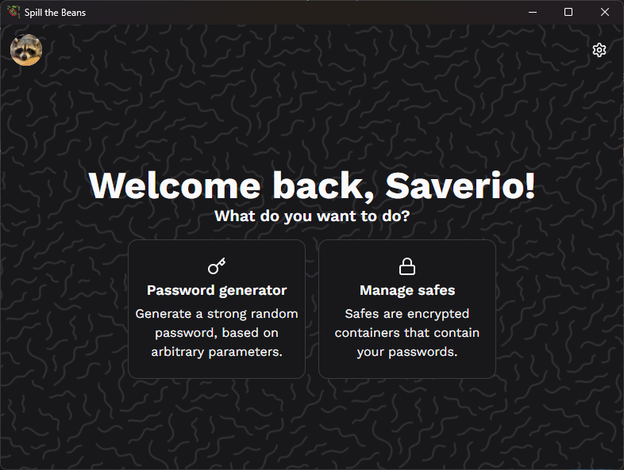

# Spill the beans 🫘

Spill the beans is a simple secret-keeping app to store all your passwords!
I started developing this app because my dad asked for a place to store all his passwords, (that is why the only languages are english and italian, he can't speak english that well)
but since it is quite useful, I shared it.

#### Prs are welcome! 🥳

The app features:
- [x] Strong password generation
- [x] Password management with encryption based on aes-256-cbc algorithm
- Basic customization (theme, profile picture, username)
- English and italian language
- [ ] Secure file containers
- [ ] Haveibeenpwned api to check if any password has been leaked

The ui is made with my personal component library [tredici](https://github.com/saverioscagnoli/tredici) ✨

### Thanks 🫂

Thanks to all these awesome products!

- [electron-vite](https://github.com/alex8088/electron-vite)
- [node-bcrypt](https://github.com/kelektiv/node.bcrypt.js)
- [chokidar](https://github.com/paulmillr/chokidar)
- [clsx](https://github.com/lukeed/clsx)
- [file-type](https://github.com/sindresorhus/file-type)
- [i18next](https://github.com/i18next/i18next) and [react-18next](https://github.com/i18next/react-i18next) (My dad is grateful)
- [react-icons](https://github.com/react-icons/react-icons)
- [react-virtualized](https://github.com/bvaughn/react-virtualized)
- [tailwind-merge](https://github.com/dcastil/tailwind-merge)
- [sharp](https://github.com/lovell/sharp)
- [faker](https://github.com/faker-js/faker)

Obviously thanks to the React and Electron teams.

# License ⚖️
MIT License @Saverio Scagnoli
